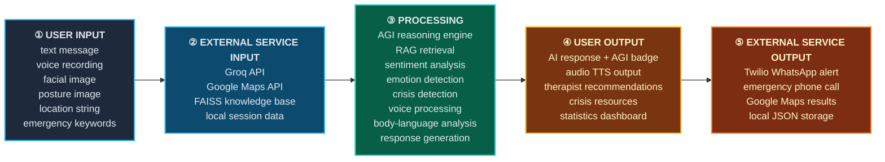
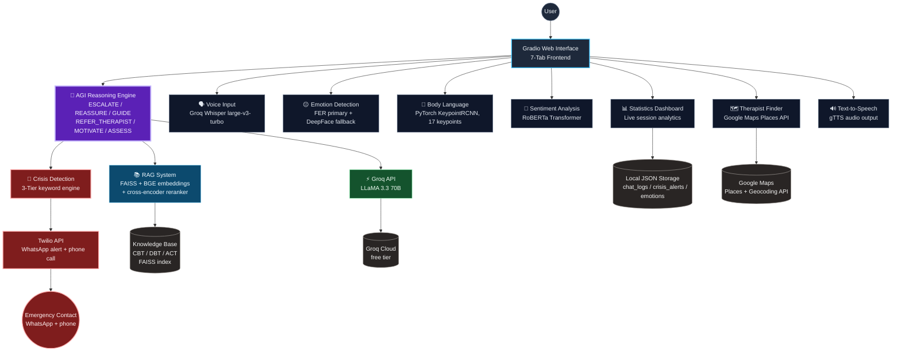
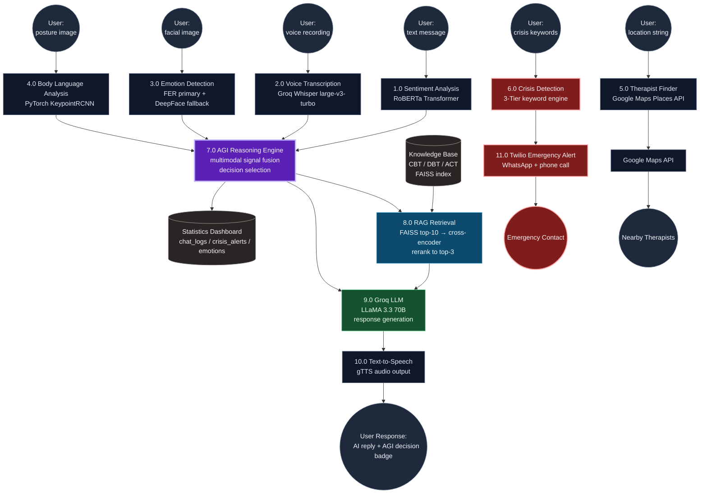

<div align="center">

# 🧠 HealMatrix AI

### Multimodal Mental Health Reasoning System — v1.4

*Text → Voice → Face → Posture → Crisis Signal → Grounded Clinical Response*

[](https://python.org)
[](https://pytorch.org)
[](https://groq.com)
[](https://github.com/facebookresearch/faiss)
[](https://gradio.app)
[](https://docker.com)
[](https://twilio.com)
[](#-ethics--safety-disclosure)

</div>

<div align="center">

```
╔══════════════════════════════════════════════════════════════════════╗
║   H E A L M A T R I X   ::   A G I   R E A S O N I N G   S T A C K     ║
║   signal-fusion  →  retrieval-grounding  →  crisis-gating  →  care    ║
╚══════════════════════════════════════════════════════════════════════╝
```

</div>

---

## 📡 What HealMatrix AI Is

HealMatrix AI fuses **six input modalities** — text, voice, face, posture, keywords, and location — into a single reasoning pipeline that produces a clinically-grounded, RAG-retrieved response, an audio readout, and — when risk thresholds are crossed — a real-world emergency escalation. It is built as a **decision-transparent system**: every reply is tagged with the exact AGI decision class (`ESCALATE` / `REASSURE` / `GUIDE` / `REFER_THERAPIST` / `MOTIVATE` / `ASSESS`) that produced it, so no output is a black box.

> ⚠️ **This is a research/engineering artifact, not a licensed clinical device.** See [Ethics & Safety Disclosure](#-ethics--safety-disclosure).

---

## 🧬 Tech Stack Icon Matrix

| Layer | Technology | Role |
|---|---|---|
| 🖥️ Interface | `Gradio` 7-tab web UI | Single surface for all modalities |
| 🗣️ Speech-to-Text | `Groq Whisper large-v3-turbo` | Sub-second voice transcription |
| 😐 Emotion Vision | `FER` (primary) → `DeepFace` (fallback) | Facial affect classification |
| 🧍 Body Language | `PyTorch KeypointRCNN` (17 keypoints) | Posture / body-language signal |
| 💬 Sentiment | `RoBERTa` transformer | Text-level polarity + intensity |
| 🚨 Crisis Engine | 3-tier keyword + pattern engine | Deterministic risk gating |
| 📚 Retrieval | `FAISS` + `BGE` embeddings + cross-encoder reranker | CBT / DBT / ACT grounded retrieval |
| 🧠 Generation | `Groq LLaMA 3.3 70B` | Final response synthesis |
| 🔊 Voice Out | `gTTS` | Audio response rendering |
| 🗺️ Therapist Match | `Google Maps Places + Geocoding API` | Real-world referral |
| 📟 Emergency | `Twilio API` (WhatsApp + Voice Call) | Human-in-the-loop crisis escalation |
| 💾 Persistence | Local JSON store (`chat_logs` / `crisis_alerts` / `emotions`) | Session + analytics record |
| 📦 Deployment | `Docker` + `docker-compose` | Reproducible container runtime |

---

## 🧩 Architecture — Three Workflows (Text-Rendered Diagrams)

All three diagrams below are written in [Mermaid](https://mermaid.js.org) — pure text that GitHub renders natively as a diagram. No binary image assets required.

### Workflow 1 — Level-0 Macro Pipeline



**Spec sheet — Stage → Method → Technology → Functionality**

| # | Stage | Method | Technology | Functionality |
|---|---|---|---|---|
| 1 | User Input | Multimodal capture | Gradio input components | Collects text, audio, image, and geo signal in one session |
| 2 | External Service Input | API + index bootstrap | Groq API, Google Maps API, FAISS, local session cache | Pulls model access, geocoding, and grounded knowledge into scope |
| 3 | Processing | Signal fusion + generation | AGI Engine, RAG, RoBERTa, FER/DeepFace, KeypointRCNN, Whisper | Converts raw signal into a reasoned, retrieval-grounded decision |
| 4 | User Output | Response assembly | TTS, badge renderer, dashboard | Surfaces the decision, audio, referrals, and live analytics |
| 5 | External Service Output | Escalation + persistence | Twilio, Google Maps, local JSON | Executes real-world side effects: alerts, referrals, logging |

---

### Workflow 2 — Context / System Diagram



**Spec sheet — Component → Method → Technology → Functionality**

| Component | Method | Technology | Functionality |
|---|---|---|---|
| AGI Reasoning Engine | Rule-gated LLM policy selection | Custom decision policy over Groq LLaMA 3.3 70B | Chooses one of 6 response classes per turn, orchestrates all sub-modules |
| Crisis Detection | Deterministic 3-tier keyword/pattern match | Regex + weighted lexicon engine | Flags risk level independent of LLM output — cannot be "talked out of" |
| RAG System | Dense retrieval + rerank | FAISS + BGE embeddings + cross-encoder | Grounds responses in CBT / DBT / ACT clinical literature |
| Voice Input | Streaming ASR | Groq Whisper large-v3-turbo | Converts speech to text in near real time |
| Emotion Detection | CNN classification, cascading fallback | FER → DeepFace | Extracts affect signal from a facial frame |
| Body Language | Keypoint pose estimation | PyTorch KeypointRCNN (17 pts) | Detects posture cues (withdrawal, agitation, stillness) |
| Sentiment Analysis | Transformer classification | RoBERTa | Scores text polarity + emotional intensity |
| Therapist Finder | Geo-search | Google Maps Places + Geocoding | Surfaces nearby licensed providers |
| Statistics Dashboard | Local aggregation | JSON-backed session store | Live view of emotion trends and crisis counts |
| Twilio Escalation | Programmable messaging + voice | Twilio API | Notifies a real human contact when risk is confirmed |

---

### Workflow 3 — Level-1 Data Flow Diagram



**Spec sheet — Process → Method → Technology → Functionality**

| ID | Process | Method | Technology | Functionality |
|---|---|---|---|---|
| 1.0 | Sentiment Analysis | Transformer inference | RoBERTa | Emits polarity + intensity vector from raw text |
| 2.0 | Voice Transcription | Streaming ASR | Groq Whisper large-v3-turbo | Converts recorded speech into text for downstream fusion |
| 3.0 | Emotion Detection | Cascaded CNN classification | FER → DeepFace fallback | Emits an emotion label + confidence from a face frame |
| 4.0 | Body Language Analysis | Keypoint pose estimation | PyTorch KeypointRCNN, 17 keypoints | Emits posture-derived behavioral signal |
| 5.0 | Therapist Finder | Geo-search | Google Maps Places API | Resolves location string → ranked nearby providers |
| 6.0 | Crisis Detection | Deterministic 3-tier lexicon match | Regex + weighted keyword engine | Gates the entire session into a safety-critical path |
| 7.0 | AGI Reasoning Engine | Multimodal fusion + policy selection | Custom decision engine | Combines 1.0–4.0 outputs into one of 6 decision classes |
| 8.0 | RAG Retrieval | Dense retrieval + rerank | FAISS (top-10) + cross-encoder (top-3) | Grounds the response in CBT/DBT/ACT source material |
| 9.0 | Groq LLM | Autoregressive generation | LLaMA 3.3 70B via Groq | Synthesizes the final natural-language response |
| 10.0 | Text-to-Speech | Neural/parametric synthesis | gTTS | Renders the response as playable audio |
| 11.0 | Twilio Emergency Alert | Programmable messaging + voice | Twilio API | Executes a real-world human escalation on confirmed risk |

> 🔴 **Safety-critical path:** `6.0 → 11.0 → Emergency Contact` runs independently of the LLM. Crisis gating is deterministic, not model-dependent — a hallucinated or evasive LLM turn cannot suppress an escalation once the keyword tier fires.

---

## 🗂️ Repository Structure

```
healmatrix-ai/
├── main.py                     # Orchestration entrypoint
├── backend.py                  # Service layer wiring all modules together
├── config.py                   # Central configuration (models, thresholds, keys)
├── agi_engine.py                # Decision policy: ESCALATE/REASSURE/GUIDE/REFER_THERAPIST/MOTIVATE/ASSESS
├── crisis_detection.py          # 3-tier keyword/pattern risk gate
├── rag_system.py                # FAISS + BGE retrieval + cross-encoder rerank
├── build_knowledge_base.py      # Builds the CBT/DBT/ACT FAISS index
├── sentiment_analysis.py        # RoBERTa text sentiment
├── emotion_detection.py         # FER + DeepFace facial emotion
├── pose_detection.py            # KeypointRCNN body-language signal
├── voice_input.py                # Groq Whisper transcription
├── therapist_finder.py          # Google Maps Places integration
├── emotion_finetuning.py        # Fine-tunes the emotion model
├── pose_finetuning.py            # Fine-tunes the pose model
├── rag_finetuning.py             # Fine-tunes retrieval/reranker components
├── run_all_training.py           # Orchestrates all fine-tuning jobs
├── download_datasets.py          # Dataset acquisition for training
├── check_emotion_weights.py      # Validates emotion model checkpoints
├── check_pose_weights.py         # Validates pose model checkpoints
├── check_rag_weights.py          # Validates retrieval model checkpoints
├── checkpoints/                  # Trained model weights
├── HealMatrix_AI_Complete.ipynb  # End-to-end notebook walkthrough
├── Dockerfile                    # Container image definition
├── docker-compose.yml            # Multi-service container orchestration
└── requirements.txt               # Python dependencies
```

---

## ⚖️ Ethics & Safety Disclosure

- **Not a replacement for clinical care.** HealMatrix AI is a research/engineering system; outputs are advisory, not diagnostic.
- **Deterministic crisis gate.** Risk detection (`6.0`) runs as a rule-based tier independent of the LLM, so escalation cannot be argued away by the model.
- **Human-in-the-loop escalation.** Confirmed risk routes to a real emergency contact via Twilio — the system never attempts to resolve a crisis unilaterally.
- **Local-first data.** Session logs, crisis alerts, and emotion history are persisted to local JSON rather than a third-party analytics platform.
- **Transparent decisioning.** Every response is tagged with its AGI decision class, so the reasoning path is auditable rather than opaque.

---

<div align="center">

*Built by [aliasjad6536](https://github.com/aliasjad6536) — [github.com/aliasjad6536/healmatrix-ai](https://github.com/aliasjad6536/healmatrix-ai)*

</div>
